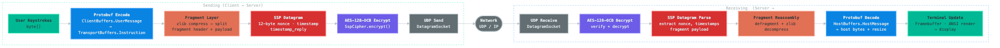

= mosh4j

Java implementation of the link:https://mosh.org[Mosh] (mobile shell) UDP/SSP protocol.
Use it as a library to build Mosh-compatible clients or servers in Java 21+.

*Releases:* link:https://github.com/chardonnay/mosh4j/releases/tag/v2.0.1[v2.0.1] — link:docs/release-notes-2.0.1.adoc[release notes]

image::docs/images/mosh4j-architecture.png[mosh4j Architecture]

== Features

* *State Synchronization Protocol (SSP)* over UDP — the same wire protocol as the official link:https://github.com/mobile-shell/mosh[mosh] C++ implementation
* *AES-128-OCB* authenticated encryption with automatic nonce management
* *Roaming support* — seamless IP/network changes, just like native Mosh
* *Three integration patterns* — consume rendered ANSI frames, raw host bytes, or direct framebuffer access
* *Terminal emulation* — built-in ANSI parser and stateful incremental renderer
* *Modular design* — use only the layers you need (crypto-only, transport-only, or full stack)
* *Java 21 (LTS)* — no native dependencies, pure Java

== Architecture

mosh4j is organized in five Maven modules that mirror the Mosh protocol layers:

[cols="1,2,2"]
|===
| Module | Description | Key Classes
| `mosh4j-protocol` | Protobuf definitions and generated DTOs | `TransportBuffers`, `ClientBuffers`, `HostBuffers`
| `mosh4j-crypto` | AES-128-OCB cipher, nonce handling, key decoding | `MoshKey`, `SspCipher`, `Nonce`
| `mosh4j-transport` | SSP transport layer (state sync, acks, fragmentation) | `TransportSender`, `TransportReceiver`, `FragmentCodec`
| `mosh4j-terminal` | Terminal state management and ANSI rendering | `Framebuffer`, `SimpleFramebuffer`, `StatefulAnsiRenderer`
| `mosh4j-core` | High-level session APIs and UDP datagram handling | `MoshClientSession`, `MoshServerSession`, `MoshTerminalFrontend`
|===

Most applications only depend on `mosh4j-core`, which transitively pulls in all other modules.

== Quick Start

=== 1. Add the dependency

[source,xml]
----
<dependency>
  <groupId>org.mosh4j</groupId>
  <artifactId>mosh4j-core</artifactId>
  <version>2.0.1</version>
</dependency>
----

=== 2. Connect to a mosh-server

First, start a mosh-server on the remote host (via SSH or any other bootstrap method). The server prints a UDP port and a Base64 key.

[source,java]
----
import org.mosh4j.core.MoshClientSession;
import org.mosh4j.core.MoshTerminalFrontend;
import org.mosh4j.crypto.MoshKey;
import java.net.InetSocketAddress;

InetSocketAddress server = new InetSocketAddress("192.168.1.100", 60001);
MoshKey key = MoshKey.fromBase64("AAAAAAAAAAAAAAAAAAAAAA");

MoshClientSession session = new MoshClientSession(server, key, 80, 24);
MoshTerminalFrontend frontend = new MoshTerminalFrontend(session);
frontend.sendInitialWakeUp();
frontend.start();

while (frontend.isRunning()) {
    String frame = frontend.takeRenderedOutput(250);
    if (frame != null) {
        System.out.print(frame);
    }
}
----

=== 3. Send user input and handle resize

[source,java]
----
frontend.sendUserInput("ls -la\n".getBytes(StandardCharsets.UTF_8));
frontend.sendResize(160, 48);
frontend.sendHeartbeat();
----

== Integration Patterns

mosh4j supports three patterns depending on your application's needs:

image::docs/images/mosh4j-integration-patterns.png[mosh4j Integration Patterns]

[cols="1,2,2"]
|===
| Pattern | Use Case | API
| *A: ANSI Frames* | Terminal widget that accepts ANSI escape sequences | `MoshTerminalFrontend.takeRenderedOutput()`
| *B: Raw Host Bytes* | App with its own terminal emulator (e.g. xterm.js, hterm) | `MoshTerminalFrontend.takeHostBytes()`
| *C: Low-Level* | Custom control over receive loop and framebuffer | `MoshClientSession.receiveOnce()` + `getFramebuffer()`
|===

For detailed examples of each pattern, including a complete korTTY-style terminal application, see the link:docs/java-integration-guide.adoc[Java Integration Guide].

== Protocol Stack

Every datagram passes through the full protocol stack: protobuf serialization, zlib-compressed fragmentation, SSP timestamping, and AES-128-OCB authenticated encryption — identical to the official Mosh wire format.

== Build

[source,bash]
----
mvn clean package
----

Requires JDK 21.

== Tests

[source,bash]
----
mvn test
----

== Test Server

Run mosh4j as a standalone test server for integration tests:

[source,bash]
----
./scripts/run-mosh4j-server.sh [port]
----

* *Port:* Default `60001`. Override via argument or `MOSH_PORT` env var.
* *Key:* If `MOSH_KEY` is not set (or invalid), a random 128-bit key is generated.
* Prints `MOSH CONNECT <port> <key-redacted>` to stderr by default. The actual key is only printed if the environment variable `MOSH_PRINT_KEY` is set to `1` (or `true`); see `MoshServerMain.java` for this behavior and how to override it. Stop with Ctrl+C.

== Documentation

* link:docs/java-integration-guide.adoc[Java Integration Guide] — comprehensive embedding guide with korTTY-style examples
* link:docs/release-notes-2.0.1.adoc[Release Notes v2.0.1] — latest changes

== Branch Strategy

* `main` — stable development
* `features/*` — new features
* `bugfixes/*` — bug fixes

Merge via Pull Request.

== License

GNU General Public License v3.0. See link:LICENSE[LICENSE].
