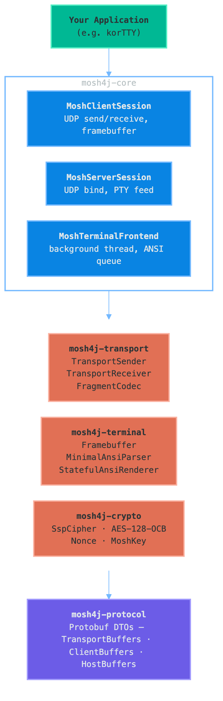
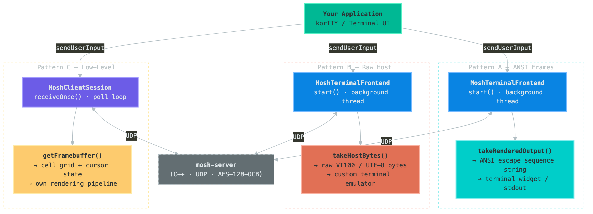
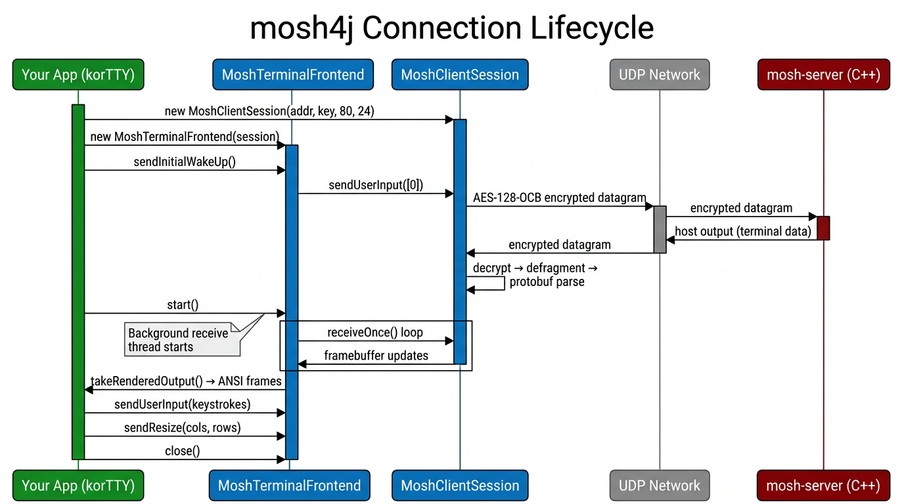

= mosh4j Java Integration Guide

Comprehensive guide for embedding mosh4j into Java applications — with real-world examples inspired by link:https://github.com/chardonnay/korTTY[korTTY], a terminal application built on mosh4j.

== Table of Contents

1. link:#1-overview[Overview]
2. link:#2-architecture[Architecture]
3. link:#3-prerequisites[Prerequisites]
4. link:#4-dependency-setup[Dependency Setup]
5. link:#5-session-bootstrap-via-ssh[Session Bootstrap via SSH]
6. link:#6-integration-patterns[Integration Patterns]
7. link:#7-complete-example-kortty-style-terminal-application[Complete Example: korTTY-Style Terminal Application]
8. link:#8-user-input-resize-and-heartbeat[User Input, Resize, and Heartbeat]
9. link:#9-session-lifecycle-management[Session Lifecycle Management]
10. link:#10-error-handling-and-reconnection[Error Handling and Reconnection]
11. link:#11-threading-model[Threading Model]
12. link:#12-embedding-a-mosh-server[Embedding a Mosh Server]
13. link:#13-javafx-integration-example[JavaFX Integration Example]
14. link:#14-swing-integration-example[Swing Integration Example]
15. link:#15-headless--cli-integration-example[Headless / CLI Integration Example]
16. link:#16-multi-session-management[Multi-Session Management]
17. link:#17-debug-and-diagnostics[Debug and Diagnostics]
18. link:#18-api-reference-summary[API Reference Summary]
19. link:#19-practical-checklist[Practical Checklist]

== 1) Overview

mosh4j provides a pure Java implementation of the Mosh UDP/SSP protocol stack. It lets your application communicate with any standard `mosh-server` (C++) without native dependencies.

*Typical flow:*
1. Your app starts a `mosh-server` on the remote host (usually via SSH)
2. The server returns a UDP port and a Base64-encoded AES-128 key
3. Your app creates a `MoshClientSession` with that port and key
4. mosh4j handles encryption, fragmentation, state sync, and terminal rendering
5. Your app consumes ANSI frames (or raw bytes) and forwards user input

== 2) Architecture

The library is split into five modules:

[source]
----
+-----------------------------------------------------+
|               Your Application (korTTY)              |
+-----------------------------------------------------+
|                    mosh4j-core                       |
|  MoshClientSession / MoshServerSession               |
|  MoshTerminalFrontend                                |
+-----------------+-----------------+------------------+
| mosh4j-         | mosh4j-         | mosh4j-crypto    |
| transport       | terminal        | SspCipher        |
| SSP state       | Framebuffer     | AES-128-OCB      |
| sync, frags     | ANSI parse/     | Nonce, MoshKey   |
|                 | render          |                  |
+-----------------+-----------------+------------------+
|                  mosh4j-protocol                     |
|     Protobuf: TransportBuffers, ClientBuffers,       |
|               HostBuffers                            |
+-----------------------------------------------------+
----
*What each module does:*

[cols="1,1"]
|===
|Module|Responsibility
|`mosh4j-protocol`|Protobuf `.proto` definitions and generated Java classes for the Mosh wire format
|`mosh4j-crypto`|AES-128-OCB authenticated encryption/decryption, 12-byte nonce construction, Base64 key decoding
|`mosh4j-transport`|State Synchronization Protocol logic — send/receive instructions, ack tracking, zlib fragment encoding
|`mosh4j-terminal`|Terminal emulation: `SimpleFramebuffer` tracks cell grid + cursor; `MinimalAnsiParser` interprets host bytes; `StatefulAnsiRenderer` produces incremental ANSI output
|`mosh4j-core`|Top-level session APIs (`MoshClientSession`, `MoshServerSession`, `MoshTerminalFrontend`) plus UDP datagram codec
|===

== 3) Prerequisites

- *Java 21+* (LTS)
- A running `mosh-server` endpoint — either the official C++ link:https://mosh.org[mosh-server] or mosh4j's own `MoshServerSession`
- A valid Mosh session tuple:
  - UDP host (IP address or hostname)
  - UDP port (e.g. `60001`)
  - `MOSH_KEY` — 22-character Base64-encoded 128-bit AES key

== 4) Dependency Setup

Add `mosh4j-core` to your Maven `pom.xml`:

[source,xml]
----
<dependency>
  <groupId>org.mosh4j</groupId>
  <artifactId>mosh4j-core</artifactId>
  <version>2.0.1</version>
</dependency>
----
For Gradle:

[source,groovy]
----
implementation 'org.mosh4j:mosh4j-core:2.0.1'
----
`mosh4j-core` transitively includes `mosh4j-protocol`, `mosh4j-crypto`, `mosh4j-transport`, and `mosh4j-terminal`. You do not need to declare them separately.

If you only need the crypto layer (e.g. for a custom protocol implementation):

[source,xml]
----
<dependency>
  <groupId>org.mosh4j</groupId>
  <artifactId>mosh4j-crypto</artifactId>
  <version>2.0.1</version>
</dependency>
----

== 5) Session Bootstrap via SSH

Before creating a `MoshClientSession`, you need a UDP port and key from a running `mosh-server`. The standard bootstrap is to start `mosh-server` via SSH:

[source,java]
----
import java.io.*;
import java.nio.charset.StandardCharsets;

public class MoshBootstrap {

    public record MoshSession(String host, int port, String key) {}

    /**
     * Start mosh-server on a remote host via SSH and parse the MOSH CONNECT line.
     */
    public static MoshSession startMoshServer(String sshUser, String sshHost)
            throws Exception {
        ProcessBuilder pb = new ProcessBuilder(
            "ssh", sshUser + "@" + sshHost,
            "mosh-server", "new", "-s", "-c", "256", "-l", "LANG=en_US.UTF-8"
        );
        pb.redirectErrorStream(true);
        Process process = pb.start();

        String connectLine = null;
        try (BufferedReader reader = new BufferedReader(
                new InputStreamReader(process.getInputStream(),
                    StandardCharsets.UTF_8))) {
            String line;
            while ((line = reader.readLine()) != null) {
                if (line.startsWith("MOSH CONNECT ")) {
                    connectLine = line;
                    break;
                }
            }
        }

        if (connectLine == null) {
            throw new IOException(
                "Failed to parse MOSH CONNECT from mosh-server output");
        }

        String[] parts = connectLine.split("\\s+");
        int port = Integer.parseInt(parts[2]);
        String key = parts[3];
        return new MoshSession(sshHost, port, key);
    }
}
----
Usage:

[source,java]
----
MoshBootstrap.MoshSession ms =
    MoshBootstrap.startMoshServer("user", "server.example.com");

InetSocketAddress addr = new InetSocketAddress(ms.host(), ms.port());
MoshKey key = MoshKey.fromBase64(ms.key());
MoshClientSession session = new MoshClientSession(addr, key, 80, 24);
----

== 6) Integration Patterns

mosh4j supports three integration patterns. Choose based on your application's terminal rendering approach:

=== Pattern A: ANSI Frame Consumer

*Best for:* terminal widgets that accept ANSI escape sequences (e.g. JediTerm, Lanterna, raw `System.out`).

[source,java]
----
import org.mosh4j.core.MoshClientSession;
import org.mosh4j.core.MoshTerminalFrontend;
import org.mosh4j.crypto.MoshKey;
import java.net.InetSocketAddress;

public class PatternA_AnsiFrames {
    public static void main(String[] args) throws Exception {
        InetSocketAddress server = new InetSocketAddress("192.168.1.100", 60001);
        MoshKey key = MoshKey.fromBase64("4kYMa9v+P1lOQ0Uy7A==");

        MoshClientSession session = new MoshClientSession(server, key, 120, 40);
        try (MoshTerminalFrontend frontend = new MoshTerminalFrontend(session)) {
            frontend.sendInitialWakeUp();
            frontend.start();

            while (frontend.isRunning()) {
                String frame = frontend.takeRenderedOutput(250);
                if (frame != null) {
                    System.out.print(frame);
                    System.out.flush();
                }
            }
        }
    }
}
----
*Key points:*
- `takeRenderedOutput(250)` blocks up to 250 ms — recommended poll interval
- The renderer tracks dirty rows and only emits CSI sequences for changed lines
- Queue capacity defaults to 256; old frames are dropped when full

=== Pattern B: Raw Host Bytes

*Best for:* apps with their own terminal emulator (xterm.js, hterm, custom VT100).

[source,java]
----
import org.mosh4j.core.MoshClientSession;
import org.mosh4j.core.MoshTerminalFrontend;
import org.mosh4j.crypto.MoshKey;
import java.net.InetSocketAddress;

public class PatternB_RawHostBytes {
    public static void main(String[] args) throws Exception {
        InetSocketAddress server = new InetSocketAddress("192.168.1.100", 60001);
        MoshKey key = MoshKey.fromBase64("4kYMa9v+P1lOQ0Uy7A==");

        MoshClientSession session = new MoshClientSession(server, key, 120, 40);
        try (MoshTerminalFrontend frontend = new MoshTerminalFrontend(session)) {
            frontend.sendInitialWakeUp();
            frontend.start();

            while (frontend.isRunning()) {
                byte[] hostBytes = frontend.takeHostBytes(250);
                if (hostBytes != null) {
                    // Feed into your own terminal emulator
                    System.out.write(hostBytes, 0, hostBytes.length);
                    System.out.flush();
                }
            }
        }
    }
}
----
*Key points:*
- Raw bytes contain VT100/ANSI escape sequences + UTF-8 text from the remote shell
- Bypasses mosh4j's built-in renderer — ideal when your UI has its own emulator
- korTTY uses this pattern to feed its custom terminal widget

=== Pattern C: Low-Level Session Loop

*Best for:* maximum control over threading, polling, and state inspection.

[source,java]
----
import org.mosh4j.core.MoshClientSession;
import org.mosh4j.crypto.MoshKey;
import org.mosh4j.terminal.Framebuffer;
import org.mosh4j.terminal.Cell;
import java.net.InetSocketAddress;

public class PatternC_LowLevel {
    public static void main(String[] args) throws Exception {
        InetSocketAddress server = new InetSocketAddress("192.168.1.100", 60001);
        MoshKey key = MoshKey.fromBase64("4kYMa9v+P1lOQ0Uy7A==");

        MoshClientSession session = new MoshClientSession(server, key, 80, 24);
        session.sendInitialWakeUp();

        try {
            while (session.isRunning()) {
                boolean progressed = session.receiveOnce();
                if (progressed) {
                    Framebuffer fb = session.getFramebuffer();
                    renderFramebuffer(fb);
                }
            }
        } finally {
            session.close();
        }
    }

    private static void renderFramebuffer(Framebuffer fb) {
        StringBuilder screen = new StringBuilder();
        screen.append("\033[H\033[2J");

        for (int row = 0; row < fb.getHeight(); row++) {
            for (int col = 0; col < fb.getWidth(); col++) {
                Cell cell = fb.getCell(row, col);
                int[] cps = cell != null ? cell.getCodePoints() : null;
                if (cps == null || cps.length == 0) {
                    screen.append(' ');
                } else {
                    for (int cp : cps) {
                        if (cp > 0) screen.appendCodePoint(cp);
                    }
                }
            }
            screen.append('\n');
        }

        screen.append(String.format("\033[%d;%dH",
            fb.getCursorRow() + 1, fb.getCursorCol() + 1));

        System.out.print(screen);
        System.out.flush();
    }
}
----
*Key points:*
- `receiveOnce()` is non-blocking (returns after UDP receive timeout, default 250 ms)
- Direct framebuffer access gives cell-level data: code points, colors, renditions

== 7) Complete Example: korTTY-Style Terminal Application

This example shows how a terminal application like korTTY structures its mosh4j integration. It demonstrates SSH bootstrap, session management, input handling, resize, and clean shutdown.

[source,java]
----
import org.mosh4j.core.MoshClientSession;
import org.mosh4j.core.MoshTerminalFrontend;
import org.mosh4j.crypto.MoshKey;

import java.io.*;
import java.net.InetSocketAddress;
import java.nio.charset.StandardCharsets;
import java.util.concurrent.atomic.AtomicBoolean;
import java.util.logging.Level;
import java.util.logging.Logger;

/**
 * Complete terminal application structure inspired by korTTY.
 */
public class KorTTYExample {

    private static final Logger LOG =
        Logger.getLogger(KorTTYExample.class.getName());

    private final String sshUser;
    private final String sshHost;
    private final int termWidth;
    private final int termHeight;
    private final AtomicBoolean running = new AtomicBoolean(true);

    private MoshClientSession session;
    private MoshTerminalFrontend frontend;

    public KorTTYExample(String user, String host, int w, int h) {
        this.sshUser = user;
        this.sshHost = host;
        this.termWidth = w;
        this.termHeight = h;
    }

    // -- Step 1: Bootstrap mosh-server via SSH --

    private record MoshCredentials(int port, String key) {}

    private MoshCredentials bootstrapMoshServer() throws Exception {
        LOG.info("Starting mosh-server on " + sshHost + " via SSH...");
        ProcessBuilder pb = new ProcessBuilder(
            "ssh", "-o", "ConnectTimeout=10",
            sshUser + "@" + sshHost,
            "mosh-server", "new", "-s", "-c", "256",
            "-l", "LANG=en_US.UTF-8"
        );
        pb.redirectErrorStream(true);
        Process process = pb.start();

        String connectLine = null;
        try (BufferedReader reader = new BufferedReader(
                new InputStreamReader(process.getInputStream(),
                    StandardCharsets.UTF_8))) {
            String line;
            while ((line = reader.readLine()) != null) {
                if (line.startsWith("MOSH CONNECT ")) {
                    connectLine = line;
                    break;
                }
            }
        }

        int exitCode = process.waitFor();
        if (connectLine == null) {
            throw new IOException("mosh-server did not return MOSH CONNECT"
                + " (SSH exit code: " + exitCode + ")");
        }

        String[] parts = connectLine.split("\\s+");
        return new MoshCredentials(
            Integer.parseInt(parts[2]), parts[3]);
    }

    // -- Step 2: Create session and frontend --

    private void connect() throws Exception {
        MoshCredentials creds = bootstrapMoshServer();
        InetSocketAddress addr =
            new InetSocketAddress(sshHost, creds.port());
        MoshKey key = MoshKey.fromBase64(creds.key());
        session = new MoshClientSession(
            addr, key, termWidth, termHeight);
        frontend = new MoshTerminalFrontend(session);
        LOG.info("Connected to " + sshHost + ":" + creds.port());
    }

    // -- Step 3: Main run loop --

    public void run() {
        try {
            connect();
            frontend.sendInitialWakeUp();
            frontend.start();

            Thread inputThread = new Thread(
                this::readUserInput, "kortty-input");
            inputThread.setDaemon(true);
            inputThread.start();

            while (running.get() && frontend.isRunning()) {
                String frame = frontend.takeRenderedOutput(250);
                if (frame != null) {
                    System.out.print(frame);
                    System.out.flush();
                }
            }
        } catch (InterruptedException e) {
            Thread.currentThread().interrupt();
            LOG.info("Session interrupted");
        } catch (Exception e) {
            LOG.log(Level.SEVERE, "Session failed", e);
        } finally {
            shutdown();
        }
    }

    // -- Step 4: Forward user keystrokes --

    private void readUserInput() {
        try {
            InputStream stdin = System.in;
            byte[] buf = new byte[1024];
            while (running.get()) {
                int available = stdin.available();
                if (available > 0) {
                    int read = stdin.read(buf, 0,
                        Math.min(available, buf.length));
                    if (read > 0) {
                        byte[] keys = new byte[read];
                        System.arraycopy(buf, 0, keys, 0, read);
                        frontend.sendUserInput(keys);
                    }
                } else {
                    Thread.sleep(10);
                }
            }
        } catch (InterruptedException e) {
            Thread.currentThread().interrupt();
        } catch (IOException e) {
            LOG.log(Level.FINE, "Input stream closed", e);
        }
    }

    // -- Step 5: Handle terminal resize --

    public void onResize(int newWidth, int newHeight) {
        if (frontend != null) {
            frontend.sendResize(newWidth, newHeight);
        }
    }

    // -- Step 6: Keepalive --

    public void sendHeartbeat() {
        if (frontend != null) frontend.sendHeartbeat();
    }

    // -- Step 7: Clean shutdown --

    private void shutdown() {
        running.set(false);
        if (frontend != null) {
            try { frontend.close(); }
            catch (Exception e) {
                LOG.log(Level.FINE, "Error closing frontend", e);
            }
        }
        LOG.info("Session closed");
    }

    public static void main(String[] args) {
        if (args.length < 2) {
            System.err.println(
                "Usage: java KorTTYExample <user> <host> [cols] [rows]");
            System.exit(1);
        }
        String user = args[0];
        String host = args[1];
        int cols = args.length > 2 ? Integer.parseInt(args[2]) : 80;
        int rows = args.length > 3 ? Integer.parseInt(args[3]) : 24;

        KorTTYExample app = new KorTTYExample(user, host, cols, rows);
        Runtime.getRuntime().addShutdownHook(new Thread(() -> {
            app.running.set(false);
            app.shutdown();
        }));
        app.run();
    }
}
----

== 8) User Input, Resize, and Heartbeat

=== Sending keystrokes

Forward raw byte arrays from your input layer. mosh4j wraps them in `ClientBuffers.UserMessage`, fragments with zlib, encrypts with AES-128-OCB, and sends over UDP:

[source,java]
----
frontend.sendUserInput(new byte[]{ 'a' });                         // single char
frontend.sendUserInput("\r".getBytes(StandardCharsets.UTF_8));      // Enter
frontend.sendUserInput(new byte[]{ 0x03 });                        // Ctrl+C
frontend.sendUserInput(new byte[]{ 0x1b, '[', 'A' });              // Arrow Up
frontend.sendUserInput("ls -la /tmp\n".getBytes(StandardCharsets.UTF_8)); // command
----
=== Sending terminal resize

[source,java]
----
componentPanel.addComponentListener(new ComponentAdapter() {
    @Override
    public void componentResized(ComponentEvent e) {
        int cols = calculateColumns(e.getComponent().getWidth());
        int rows = calculateRows(e.getComponent().getHeight());
        frontend.sendResize(cols, rows);
    }
});
----
=== Keepalive / heartbeat

[source,java]
----
ScheduledExecutorService scheduler =
    Executors.newSingleThreadScheduledExecutor();
scheduler.scheduleAtFixedRate(
    () -> frontend.sendHeartbeat(),
    30, 30, TimeUnit.SECONDS
);
----
The heartbeat sends an ack-only SSP packet without user input bytes.

== 9) Session Lifecycle Management

=== Phase 1: Bootstrap

[source,java]
----
MoshCredentials creds = bootstrapMoshServer();
----
=== Phase 2: Session creation

[source,java]
----
InetSocketAddress addr = new InetSocketAddress(host, creds.port());
MoshKey key = MoshKey.fromBase64(creds.key());
MoshClientSession session = new MoshClientSession(addr, key, cols, rows);
----
=== Phase 3: Frontend setup

[source,java]
----
MoshTerminalFrontend frontend = new MoshTerminalFrontend(session);
frontend.sendInitialWakeUp();  // trigger first server frame
frontend.start();              // start background receive thread
----
=== Phase 4: Active session

[source,java]
----
while (frontend.isRunning()) {
    String frame = frontend.takeRenderedOutput(250);
    if (frame != null) render(frame);
}
----
=== Phase 5: Shutdown

[source,java]
----
frontend.close();
----
`MoshTerminalFrontend` implements `Closeable` — use try-with-resources:

[source,java]
----
try (MoshTerminalFrontend frontend = new MoshTerminalFrontend(session)) {
    frontend.sendInitialWakeUp();
    frontend.start();
    // ... use session ...
}
----

== 10) Error Handling and Reconnection

=== Transient network errors

mosh4j handles transient UDP errors internally — dropped packets, temporary outages, and IP changes (roaming) are handled by the SSP protocol.

=== Reconnection pattern (korTTY-style)

[source,java]
----
public class ResilientMoshClient {
    private static final int MAX_RETRIES = 5;
    private static final long RETRY_DELAY_MS = 3000;

    public void connectWithRetry(String user, String host,
            int cols, int rows) {
        for (int attempt = 1; attempt <= MAX_RETRIES; attempt++) {
            try {
                MoshBootstrap.MoshSession ms =
                    MoshBootstrap.startMoshServer(user, host);
                InetSocketAddress addr =
                    new InetSocketAddress(ms.host(), ms.port());
                MoshKey key = MoshKey.fromBase64(ms.key());

                try (var session = new MoshClientSession(
                        addr, key, cols, rows);
                     var frontend =
                        new MoshTerminalFrontend(session)) {
                    frontend.sendInitialWakeUp();
                    frontend.start();
                    while (frontend.isRunning()) {
                        String frame =
                            frontend.takeRenderedOutput(250);
                        if (frame != null) {
                            System.out.print(frame);
                            System.out.flush();
                        }
                    }
                }
                return;
            } catch (Exception e) {
                System.err.println("Attempt " + attempt + "/"
                    + MAX_RETRIES + " failed: " + e.getMessage());
                if (attempt < MAX_RETRIES) {
                    try { Thread.sleep(RETRY_DELAY_MS); }
                    catch (InterruptedException ie) {
                        Thread.currentThread().interrupt();
                        return;
                    }
                }
            }
        }
        System.err.println("All connection attempts exhausted.");
    }
}
----

== 11) Threading Model

[source]
----
+-----------------------------------------------+
|              Your Application                  |
|  +--------------+    +--------------------+    |
|  |  UI Thread   |    |   Input Thread     |    |
|  | takeRendered |    | sendUserInput()    |    |
|  | Output()     |    | sendResize()       |    |
|  +------+-------+    +--------+-----------+    |
|         |                     |                |
|         v                     v                |
|  +---------------------------------------------+
[cols="1,1"]
|===
||MoshTerminalFrontend
|||Background Receive Thread (daemon)|
|===

[cols="1"]
|===
|+---------------------------------------------+
|===

+-----------------------------------------------+
----
*Thread-safety rules:*
- `sendUserInput()`, `sendResize()`, `sendHeartbeat()` — safe from any thread
- `takeRenderedOutput()` / `takeHostBytes()` — safe from any single consumer thread
- Background receive thread is a daemon — will not prevent JVM shutdown
- `close()` — safe from any thread; interrupts receive thread

*Single-threaded alternative* (no background thread):

[source,java]
----
MoshTerminalFrontend frontend = new MoshTerminalFrontend(session);
frontend.sendInitialWakeUp();

while (frontend.isRunning()) {
    frontend.pollOnce();
    String frame = frontend.pollRenderedOutput();
    if (frame != null) render(frame);
    Thread.sleep(10);
}
----

== 12) Embedding a Mosh Server

[source,java]
----
import org.mosh4j.core.MoshServerSession;
import org.mosh4j.crypto.MoshKey;
import java.security.SecureRandom;
import java.util.Base64;

public class EmbeddedMoshServer {
    public static void main(String[] args) throws Exception {
        byte[] keyBytes = new byte[16];
        new SecureRandom().nextBytes(keyBytes);
        String keyBase64 =
            Base64.getEncoder().encodeToString(keyBytes);
        MoshKey key = MoshKey.fromBytes(keyBytes);

        int port = 60001;
        MoshServerSession server =
            new MoshServerSession(port, key, 80, 24);
        System.err.println("MOSH CONNECT " + port + " " + keyBase64);

        Thread ptyThread = new Thread(() -> {
            String welcome =
                "Welcome to mosh4j embedded server!\r\n$ ";
            server.feedHostOutput(welcome.getBytes());
        }, "pty-feeder");
        ptyThread.setDaemon(true);
        ptyThread.start();

        while (server.isRunning()) {
            server.receiveOnce();
        }
    }
}
----
*Server API:*

[cols="1,1"]
|===
|Method|Description
|`MoshServerSession(port, key, w, h)`|Bind UDP socket
|`feedHostOutput(byte[])`|Push terminal bytes to client
|`receiveOnce()`|Process one client datagram
|`getFramebuffer()`|Access server framebuffer
|`close()`|Stop server
|`isRunning()`|Check if active
|===

== 13) JavaFX Integration Example

Complete example embedding mosh4j into a JavaFX application:

[source,java]
----
import javafx.application.Application;
import javafx.application.Platform;
import javafx.scene.Scene;
import javafx.scene.control.TextArea;
import javafx.scene.input.KeyEvent;
import javafx.scene.layout.BorderPane;
import javafx.stage.Stage;

import org.mosh4j.core.MoshClientSession;
import org.mosh4j.core.MoshTerminalFrontend;
import org.mosh4j.crypto.MoshKey;

import java.net.InetSocketAddress;
import java.nio.charset.StandardCharsets;

public class MoshFxTerminal extends Application {

    private MoshTerminalFrontend frontend;

    @Override
    public void start(Stage primaryStage) throws Exception {
        TextArea terminal = new TextArea();
        terminal.setStyle(
            "-fx-font-family: 'Courier New'; -fx-font-size: 14;");
        terminal.setEditable(false);
        terminal.setWrapText(false);

        terminal.addEventFilter(KeyEvent.KEY_TYPED, event -> {
            String ch = event.getCharacter();
            if (!ch.isEmpty() && frontend != null) {
                frontend.sendUserInput(
                    ch.getBytes(StandardCharsets.UTF_8));
            }
            event.consume();
        });

        terminal.addEventFilter(KeyEvent.KEY_PRESSED, event -> {
            byte[] seq = mapKeyToAnsiSequence(event);
            if (seq != null && frontend != null) {
                frontend.sendUserInput(seq);
            }
        });

        BorderPane root = new BorderPane(terminal);
        Scene scene = new Scene(root, 800, 600);
        primaryStage.setTitle("mosh4j JavaFX Terminal");
        primaryStage.setScene(scene);
        primaryStage.show();

        InetSocketAddress server =
            new InetSocketAddress("192.168.1.100", 60001);
        MoshKey key = MoshKey.fromBase64("4kYMa9v+P1lOQ0Uy7A==");
        MoshClientSession session =
            new MoshClientSession(server, key, 80, 24);
        frontend = new MoshTerminalFrontend(session);
        frontend.sendInitialWakeUp();
        frontend.start();

        Thread renderThread = new Thread(() -> {
            try {
                while (frontend.isRunning()) {
                    byte[] hostBytes = frontend.takeHostBytes(250);
                    if (hostBytes != null) {
                        String text = new String(
                            hostBytes, StandardCharsets.UTF_8);
                        Platform.runLater(
                            () -> terminal.appendText(text));
                    }
                }
            } catch (InterruptedException e) {
                Thread.currentThread().interrupt();
            }
        }, "mosh-render");
        renderThread.setDaemon(true);
        renderThread.start();

        scene.widthProperty().addListener((obs, oldV, newV) -> {
            int cols = Math.max(1, newV.intValue() / 9);
            int rows = Math.max(1, (int) scene.getHeight() / 18);
            frontend.sendResize(cols, rows);
        });

        primaryStage.setOnCloseRequest(event -> {
            if (frontend != null) frontend.close();
        });
    }

    private byte[] mapKeyToAnsiSequence(KeyEvent event) {
        return switch (event.getCode()) {
            case ENTER      -> new byte[]{ '\r' };
            case BACK_SPACE -> new byte[]{ 0x7f };
            case TAB        -> new byte[]{ '\t' };
            case ESCAPE     -> new byte[]{ 0x1b };
            case UP         -> new byte[]{ 0x1b, '[', 'A' };
            case DOWN       -> new byte[]{ 0x1b, '[', 'B' };
            case RIGHT      -> new byte[]{ 0x1b, '[', 'C' };
            case LEFT       -> new byte[]{ 0x1b, '[', 'D' };
            case HOME       -> new byte[]{ 0x1b, '[', 'H' };
            case END        -> new byte[]{ 0x1b, '[', 'F' };
            case PAGE_UP    -> new byte[]{ 0x1b, '[', '5', '~' };
            case PAGE_DOWN  -> new byte[]{ 0x1b, '[', '6', '~' };
            case DELETE     -> new byte[]{ 0x1b, '[', '3', '~' };
            case INSERT     -> new byte[]{ 0x1b, '[', '2', '~' };
            default -> null;
        };
    }

    public static void main(String[] args) { launch(args); }
}
----

== 14) Swing Integration Example

For Swing-based applications:

[source,java]
----
import javax.swing.*;
import java.awt.*;
import java.awt.event.*;
import java.nio.charset.StandardCharsets;

import org.mosh4j.core.MoshClientSession;
import org.mosh4j.core.MoshTerminalFrontend;
import org.mosh4j.crypto.MoshKey;
import java.net.InetSocketAddress;

public class MoshSwingTerminal extends JFrame {

    private MoshTerminalFrontend frontend;
    private final JTextArea terminalArea;

    public MoshSwingTerminal() {
        setTitle("mosh4j Swing Terminal");
        setDefaultCloseOperation(JFrame.EXIT_ON_CLOSE);
        setSize(900, 600);

        terminalArea = new JTextArea();
        terminalArea.setFont(
            new Font("Monospaced", Font.PLAIN, 14));
        terminalArea.setBackground(Color.BLACK);
        terminalArea.setForeground(Color.GREEN);
        terminalArea.setCaretColor(Color.GREEN);
        terminalArea.setEditable(false);

        terminalArea.addKeyListener(new KeyAdapter() {
            @Override
            public void keyTyped(KeyEvent e) {
                if (frontend == null) return;
                char ch = e.getKeyChar();
                if (ch != KeyEvent.CHAR_UNDEFINED) {
                    frontend.sendUserInput(String.valueOf(ch)
                        .getBytes(StandardCharsets.UTF_8));
                }
            }

            @Override
            public void keyPressed(KeyEvent e) {
                if (frontend == null) return;
                byte[] seq = mapSwingKeyToAnsi(e);
                if (seq != null) {
                    frontend.sendUserInput(seq);
                    e.consume();
                }
            }
        });

        addComponentListener(new ComponentAdapter() {
            @Override
            public void componentResized(ComponentEvent e) {
                if (frontend != null) {
                    FontMetrics fm = terminalArea.getFontMetrics(
                        terminalArea.getFont());
                    int cols = Math.max(1,
                        terminalArea.getWidth() / fm.charWidth('M'));
                    int rows = Math.max(1,
                        terminalArea.getHeight() / fm.getHeight());
                    frontend.sendResize(cols, rows);
                }
            }
        });

        add(new JScrollPane(terminalArea), BorderLayout.CENTER);
    }

    public void connect(String host, int port, String keyBase64)
            throws Exception {
        InetSocketAddress addr = new InetSocketAddress(host, port);
        MoshKey key = MoshKey.fromBase64(keyBase64);
        MoshClientSession session =
            new MoshClientSession(addr, key, 80, 24);
        frontend = new MoshTerminalFrontend(session);
        frontend.sendInitialWakeUp();
        frontend.start();

        Thread renderThread = new Thread(() -> {
            try {
                while (frontend.isRunning()) {
                    byte[] bytes = frontend.takeHostBytes(250);
                    if (bytes != null) {
                        String text = new String(
                            bytes, StandardCharsets.UTF_8);
                        SwingUtilities.invokeLater(() -> {
                            terminalArea.append(text);
                            terminalArea.setCaretPosition(
                                terminalArea.getDocument()
                                    .getLength());
                        });
                    }
                }
            } catch (InterruptedException e) {
                Thread.currentThread().interrupt();
            }
        }, "mosh-render");
        renderThread.setDaemon(true);
        renderThread.start();
    }

    private byte[] mapSwingKeyToAnsi(KeyEvent e) {
        return switch (e.getKeyCode()) {
            case KeyEvent.VK_ENTER      -> new byte[]{ '\r' };
            case KeyEvent.VK_BACK_SPACE -> new byte[]{ 0x7f };
            case KeyEvent.VK_TAB        -> new byte[]{ '\t' };
            case KeyEvent.VK_ESCAPE     -> new byte[]{ 0x1b };
            case KeyEvent.VK_UP    -> new byte[]{ 0x1b, '[', 'A' };
            case KeyEvent.VK_DOWN  -> new byte[]{ 0x1b, '[', 'B' };
            case KeyEvent.VK_RIGHT -> new byte[]{ 0x1b, '[', 'C' };
            case KeyEvent.VK_LEFT  -> new byte[]{ 0x1b, '[', 'D' };
            case KeyEvent.VK_HOME  -> new byte[]{ 0x1b, '[', 'H' };
            case KeyEvent.VK_END   -> new byte[]{ 0x1b, '[', 'F' };
            default -> null;
        };
    }

    @Override
    public void dispose() {
        if (frontend != null) frontend.close();
        super.dispose();
    }

    public static void main(String[] args) throws Exception {
        if (args.length < 3) {
            System.err.println(
                "Usage: MoshSwingTerminal <host> <port> <key>");
            System.exit(1);
        }
        MoshSwingTerminal term = new MoshSwingTerminal();
        term.setVisible(true);
        term.connect(
            args[0], Integer.parseInt(args[1]), args[2]);
    }
}
----

== 15) Headless / CLI Integration Example

Minimal headless client for automation, scripting, or testing:

[source,java]
----
import org.mosh4j.core.MoshClientSession;
import org.mosh4j.core.MoshTerminalFrontend;
import org.mosh4j.crypto.MoshKey;
import java.net.InetSocketAddress;
import java.nio.charset.StandardCharsets;

/**
 * Headless mosh client: connect, run a command, capture output.
 */
public class HeadlessMoshClient {

    public static String executeRemoteCommand(
            String host, int port, String keyBase64,
            String command, long timeoutMs) throws Exception {

        InetSocketAddress addr = new InetSocketAddress(host, port);
        MoshKey key = MoshKey.fromBase64(keyBase64);
        StringBuilder output = new StringBuilder();
        long deadline = System.currentTimeMillis() + timeoutMs;

        try (var session = new MoshClientSession(addr, key, 200, 50);
             var frontend = new MoshTerminalFrontend(session)) {

            frontend.sendInitialWakeUp();
            frontend.start();
            Thread.sleep(500);

            // Drain initial prompt
            for (int i = 0; i < 10; i++) {
                String frame = frontend.takeRenderedOutput(100);
                if (frame != null) output.append(frame);
            }

            // Send command
            frontend.sendUserInput(
                (command + "\n").getBytes(StandardCharsets.UTF_8));

            // Collect output
            while (System.currentTimeMillis() < deadline) {
                String frame = frontend.takeRenderedOutput(250);
                if (frame != null) output.append(frame);
            }
        }
        return output.toString();
    }

    public static void main(String[] args) throws Exception {
        String result = executeRemoteCommand(
            "192.168.1.100", 60001, "4kYMa9v+P1lOQ0Uy7A==",
            "uname -a", 5000);
        System.out.println("Remote output:\n" + result);
    }
}
----

== 16) Multi-Session Management

Applications like korTTY often manage multiple simultaneous sessions (tabbed terminals):

[source,java]
----
import org.mosh4j.core.MoshClientSession;
import org.mosh4j.core.MoshTerminalFrontend;
import org.mosh4j.crypto.MoshKey;
import java.net.InetSocketAddress;
import java.util.Map;
import java.util.concurrent.ConcurrentHashMap;
import java.util.concurrent.atomic.AtomicInteger;

public class SessionManager {

    private final Map<Integer, MoshTerminalFrontend> sessions =
        new ConcurrentHashMap<>();
    private final AtomicInteger nextId = new AtomicInteger(1);

    public int openSession(String host, int port,
            String keyBase64, int cols, int rows) throws Exception {
        InetSocketAddress addr = new InetSocketAddress(host, port);
        MoshKey key = MoshKey.fromBase64(keyBase64);
        MoshClientSession session =
            new MoshClientSession(addr, key, cols, rows);
        MoshTerminalFrontend frontend =
            new MoshTerminalFrontend(session);
        frontend.sendInitialWakeUp();
        frontend.start();
        int id = nextId.getAndIncrement();
        sessions.put(id, frontend);
        return id;
    }

    public void sendInput(int id, byte[] input) {
        MoshTerminalFrontend f = sessions.get(id);
        if (f != null && f.isRunning()) f.sendUserInput(input);
    }

    public String pollOutput(int id) throws InterruptedException {
        MoshTerminalFrontend f = sessions.get(id);
        return (f != null && f.isRunning())
            ? f.takeRenderedOutput(100) : null;
    }

    public void closeSession(int id) {
        MoshTerminalFrontend f = sessions.remove(id);
        if (f != null) f.close();
    }

    public void closeAll() {
        sessions.forEach((id, f) -> {
            try { f.close(); } catch (Exception ignored) {}
        });
        sessions.clear();
    }

    public int activeCount() {
        return (int) sessions.values().stream()
            .filter(MoshTerminalFrontend::isRunning).count();
    }
}
----

== 17) Debug and Diagnostics

=== Enable debug logging

Set `KORTTY_MOSH_DEBUG=true` for verbose datagram-level logging:

[source,bash]
----
export KORTTY_MOSH_DEBUG=true
java -jar your-app.jar
----
=== Java Util Logging configuration

mosh4j uses `java.util.logging`. To see FINE-level logs:

[source,properties]
----
= logging.properties
org.mosh4j.level = FINE
handlers = java.util.logging.ConsoleHandler
java.util.logging.ConsoleHandler.level = FINE
----
[source,bash]
----
java -Djava.util.logging.config.file=logging.properties -jar your-app.jar
----
=== Framebuffer inspection

[source,java]
----
Framebuffer fb = session.getFramebuffer();
System.out.println("Size: " + fb.getWidth() + "x" + fb.getHeight());
System.out.println("Cursor: row=" + fb.getCursorRow()
    + " col=" + fb.getCursorCol());
System.out.println("Visible: " + fb.isCursorVisible());

for (int row = 0; row < fb.getHeight(); row++) {
    StringBuilder line = new StringBuilder();
    for (int col = 0; col < fb.getWidth(); col++) {
        Cell cell = fb.getCell(row, col);
        int[] cps = cell != null ? cell.getCodePoints() : null;
        if (cps == null || cps.length == 0 || cps[0] <= 0) {
            line.append(' ');
        } else {
            for (int cp : cps) line.appendCodePoint(cp);
        }
    }
    System.out.println("Row " + row + ": [" + line + "]");
}
----

== 18) API Reference Summary

=== MoshClientSession

[cols="1,1"]
|===
|Method|Description
|`MoshClientSession(addr, key, w, h)`|Create session
|`sendInitialWakeUp()`|Trigger first server frame
|`sendUserInput(byte[])`|Send keystrokes
|`sendResize(int, int)`|Notify resize
|`receiveOnce()`|Receive one datagram (poll-friendly)
|`getFramebuffer()`|Access framebuffer
|`pollHostBytes()`|Non-blocking raw bytes
|`takeHostBytes(long)`|Blocking raw bytes
|`sendHeartbeat()`|Send keepalive
|`close()`|Close session
|`isRunning()`|Check active
|===

=== MoshTerminalFrontend

[cols="1,1"]
|===
|Method|Description
|`MoshTerminalFrontend(session)`|Default frontend
|`MoshTerminalFrontend(session, renderer, cap)`|Custom renderer + queue
|`start()`|Start receive thread
|`pollOnce()`|Single-threaded receive
|`sendInitialWakeUp()`|Wake up server
|`sendUserInput(byte[])`|Forward keystrokes
|`sendResize(int, int)`|Forward resize
|`sendHeartbeat()`|Send keepalive
|`pollRenderedOutput()`|Non-blocking ANSI frame
|`takeRenderedOutput(long)`|Blocking ANSI frame
|`pollHostBytes()`|Non-blocking raw bytes
|`takeHostBytes(long)`|Blocking raw bytes
|`pendingFrames()`|Queued frame count
|`isRunning()`|Check active
|`close()`|Stop + close
|===

=== MoshServerSession

[cols="1,1"]
|===
|Method|Description
|`MoshServerSession(port, key, w, h)`|Bind UDP port
|`feedHostOutput(byte[])`|Push bytes to client
|`receiveOnce()`|Process client datagram
|`getFramebuffer()`|Server framebuffer
|`close()`|Stop server
|`isRunning()`|Check active
|===

=== MoshKey

[cols="1,1"]
|===
|Method|Description
|`MoshKey.fromBase64(String)`|Decode 22-char Base64 key
|`MoshKey.fromBytes(byte[])`|From raw 16 bytes
|`getKeyBytes()`|Raw key bytes
|===

=== StatefulAnsiRenderer

[cols="1,1"]
|===
|Method|Description
|`render(Framebuffer)`|Produce ANSI string
|`reset()`|Force full redraw on next render
|===

== 19) Practical Checklist

- [ ] Decode and validate key with `MoshKey.fromBase64()`
- [ ] Create `MoshClientSession` with correct host, port, width, height
- [ ] Call `sendInitialWakeUp()` once after creating the session
- [ ] Choose integration pattern (A: ANSI frames, B: raw bytes, C: low-level)
- [ ] Forward user keystrokes via `sendUserInput(byte[])`
- [ ] Forward window resize via `sendResize(cols, rows)`
- [ ] Schedule periodic `sendHeartbeat()` during idle (every 30s)
- [ ] Handle `InterruptedException` on blocking poll methods
- [ ] Always `close()` on shutdown (use try-with-resources)
- [ ] Register a JVM shutdown hook for clean cleanup
- [ ] Enable `KORTTY_MOSH_DEBUG=true` for troubleshooting
